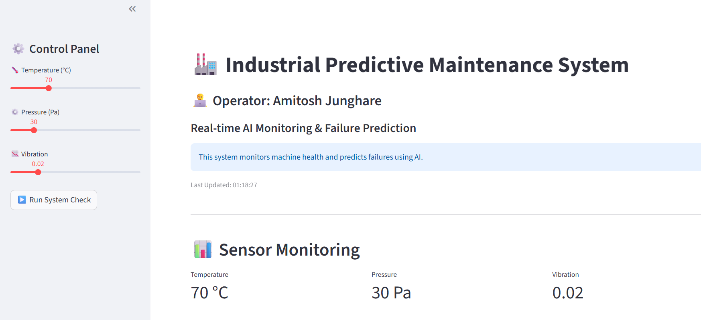
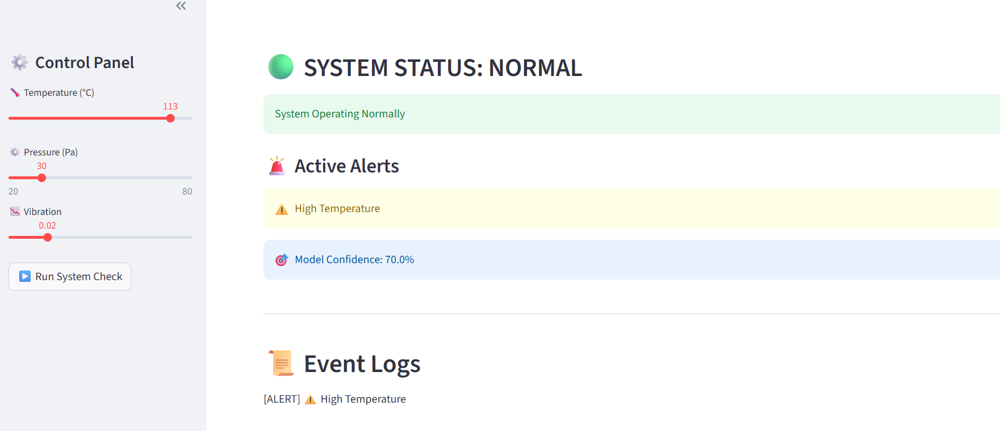
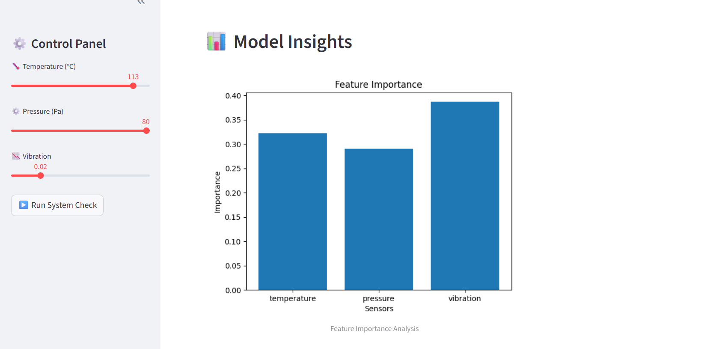

# 🏭 AI-Based Predictive Maintenance System

## 🚀 Industrial AI Project

This project simulates a real-world predictive maintenance system used in industrial automation to monitor machine health and prevent failures using AI.

---

## 📌 Overview

This system uses machine learning to predict machine failures based on sensor inputs such as temperature, pressure, and vibration.

It provides a real-time dashboard with alerts, confidence scores, and visual insights.

---

## 🧠 Key Engineering Features

* Real-time sensor monitoring (Temperature, Pressure, Vibration)
* Hybrid alert system (Rule-based + AI-based)
* Machine failure prediction using ML model
* Confidence scoring for prediction reliability
* Feature importance visualization
* Event logging system
* Industrial-style dashboard (Streamlit)

---

## 🚨 Features

* 🔍 Real-Time Monitoring Dashboard
* 🤖 AI-Based Failure Prediction
* 🎯 Prediction Confidence Score
* 🚨 Multi-Level Alert System

  * Warning Alerts
  * Critical Alerts
  * AI-Based Alerts
* 📊 Sensor Trend Visualization
* 📜 Event Logs

---

## 🛠️ Tech Stack

* Python
* Scikit-learn
* Pandas, NumPy
* Matplotlib
* Streamlit

---

## 📂 Project Structure

predictive-maintenance/
│
├── data/
├── src/
├── model/
├── app/
│   └── app.py
├── requirements.txt
└── README.md

---

## ⚙️ How It Works

1. User inputs sensor data (temperature, pressure, vibration)
2. Data is passed to ML model
3. Model predicts machine condition (Failure / Normal)
4. Alert system evaluates:

   * Threshold conditions
   * Critical conditions
   * AI prediction
5. Dashboard displays:

   * System status
   * Alerts
   * Confidence score
   * Graphs

---

## ▶️ How to Run

pip install -r requirements.txt

cd src
python train_model.py

cd ../app
streamlit run app.py

---

## 📸 System Screenshots

### 🏭 Dashboard

---

### 🚨 Alerts (Critical Condition)

---

### 📈 Sensor Trends

---

## 💡 Future Improvements

* Multi-machine monitoring system
* Real-time sensor data integration
* Cloud deployment
* Database logging

---

## 👨‍💻 Author

**Amitosh Junghare**
AIML Student | Aspiring AI Engineer

---

## ⭐ Project Highlights

* Combines machine learning with industrial automation concepts
* Demonstrates real-world predictive maintenance system
* Designed with focus on industry applications
